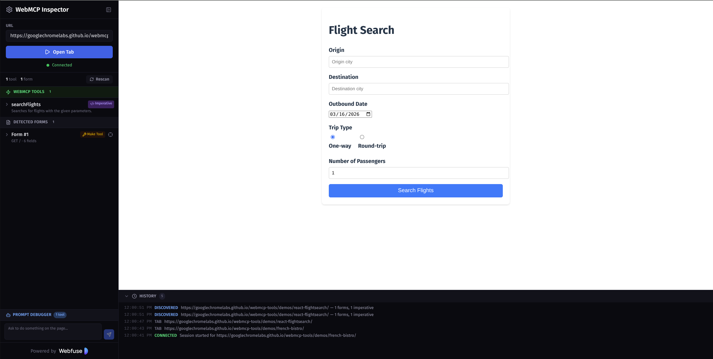

# WebMCP Inspector

Inspect, debug, and augment [WebMCP](https://webmachinelearning.github.io/webmcp/) tools on any webpage — in real time.

WebMCP Inspector discovers both **declarative** (HTML form-based) and **imperative** (JavaScript API) tools exposed via the WebMCP specification. It lets you view schemas, edit attributes, execute tools, and test with Chrome's on-device Gemini Nano model, all through a live sandboxed browser session powered by [Webfuse](https://www.webfuse.com).



## Features

### Tool Discovery
- **Declarative tools** — Scans pages for HTML forms annotated with WebMCP attributes (`toolname`, `tooldescription`, `toolparamtitle`, `toolparamdescription`, `toolautosubmit`)
- **Imperative tools** — Detects tools registered via `navigator.modelContext.registerTool()` with full input schema support (requires Chrome 146+)
- **Form augmentation** — Turn any plain HTML form into a WebMCP tool by adding metadata through the UI. Overrides are saved per-URL in localStorage and restored automatically on revisit

### Inspection & Debugging
- **Schema viewer** — View the generated JSON schema for any discovered tool
- **Form highlighter** — Locate and highlight forms directly on the target page
- **Tool execution** — Call any tool directly from the sidebar with typed parameter inputs and view results in real time
- **Prompt Debugger** — Chat interface powered by Chrome's built-in Gemini Nano model (via the [Prompt API](https://developer.chrome.com/docs/ai/built-in)). The on-device agent autonomously discovers and calls tools based on natural language prompts
- **Activity log** — Real-time history of tool discovery, augmentation, execution, and navigation events

### Environment
- **Live preview** — Target pages are rendered in a sandboxed [Webfuse](https://www.webfuse.com) session alongside the inspector. No browser extension install required.
- **Webfuse Extension** — Included Manifest V3 content script for direct page introspection (used internally by Webfuse sessions)
- **URL history** — Recently visited URLs are saved and shown as autocomplete suggestions

## Getting Started

### Prerequisites

- Node.js 22+
- npm

### Setup

```bash
git clone https://github.com/nichochar/webmcpinspector.git
cd webmcpinspector
npm install
```

Create a `.env` file from the example (required for dev mode):

```bash
cp .env.example .env
```

Fill in your Webfuse widget key and space ID for the development environment:

```
VITE_WIDGET_KEY_DEV=your_dev_widget_key
VITE_SPACE_ID_DEV=your_dev_space_id
```

### Development

```bash
npm run dev
```

Opens at `http://localhost:5173/inspect/`.

### Build

```bash
npm run build
```

Output goes to `dist/`.

### Lint

```bash
npm run lint
```

### Docker

```bash
docker build -t webmcp-inspector .
docker run -p 8080:80 webmcp-inspector
```

The app is served at `http://localhost:8080/inspect/` with the landing page at `/`.

## Project Structure

```
src/
  App.tsx              # Main app — session management, state, messaging
  components/
    Sidebar.tsx        # Tool/form listing, attribute editing, save/reset
    MainContent.tsx    # Iframe container (Webfuse session) + activity log
    PromptPanel.tsx    # Gemini Nano chat UI for tool execution via Prompt API
  types.ts             # Shared TypeScript interfaces
  analytics.ts         # Plausible analytics wrapper

public/
  extension/
    manifest.json      # Webfuse Extension manifest (Manifest V3)
    content.js         # Content script — form scanning, attribute patching,
                       #   imperative tool interception, message bridge
  landing.html         # Static landing page
```

## How It Works

1. **Connect** — Enter a URL. Webfuse opens a sandboxed browser session rendering the target page
2. **Scan** — The content script scans the page for WebMCP-annotated forms and imperative tools registered via `navigator.modelContext`
3. **Inspect** — Discovered tools appear in the sidebar with their attributes, parameters, and generated schemas
4. **Augment** — Edit WebMCP attributes on any form or add them to plain forms. Changes are applied live via message passing and persisted in localStorage
5. **Execute** — Call imperative tools directly with parameter inputs, or use the Prompt Debugger to have Gemini Nano orchestrate tool calls from natural language
6. **Debug** — The activity log tracks all events. Schema viewer shows the exact JSON schema that would be exposed to an AI agent

## Chrome Flags

Some features require experimental Chrome flags:

| Feature | Flag | Chrome Version |
|---------|------|---------------|
| Imperative tools (JS API) | `chrome://flags/#enable-webmcp-testing` | 146+ |
| Prompt Debugger (Gemini Nano) | `chrome://flags/#prompt-api-for-gemini-nano` | 138+ |

## Related Links

- [WebMCP Specification](https://webmachinelearning.github.io/webmcp/)
- [Chrome WebMCP Announcement](https://developer.chrome.com/blog/webmcp-epp)
- [WebMCP Demo Pages](https://googlechromelabs.github.io/webmcp-tools/demos/)
- [Webfuse](https://www.webfuse.com)

## License

MIT
